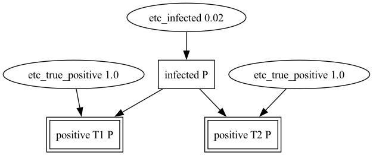

# EtcAbductionPy

## An implementation of Etcetera Abduction in Python

This software is a reference implementation of Etcetera Abduction. Given a knowledge base of first-order definite clauses and a set of observables, this software identifies the most probable set of assumptions that logically entails the observations, assuming the conditional independence of each assumption. 

For more information, see the project homepage: http://asgordon.github.io/EtcAbductionPy/

## Getting started

Please use `uv` for a modern Python environment and ease-of-use. Installation: [here](https://docs.astral.sh/uv/getting-started/installation/)

```
git clone https://github.com/asgordon/EtcAbductionPy.git
cd EtcAbductionPy
uv run -m etcabductionpy -h
```

## Example

A rare disease (2% prevalence) has a test with 100% sensitivity and 5% false positive rate. One positive test only implies ~29% infection probability. What happens with *two* positive tests?

`docs/infection2x2.lisp`:

```
(positive T1 P)
(positive T2 P)

(if (and (infected x)
         (etc_true_positive 1.0 t x))
    (positive t x))

(if (and (healthy x)
         (etc_false_positive 0.05 t x))
    (positive t x))

(if (etc_healthy 0.98 x)
    (healthy x))

(if (etc_infected 0.02 x)
    (infected x))

(if (etc_positive 0.069 t x)
    (positive t x))
```

Compute all possible interpretations (probability-ordered):

```
uv run python -m etcabductionpy -i docs/infection2x2.lisp

[(etc_true_positive 1.0 T1 P), (etc_true_positive 1.0 T2 P), (etc_infected 0.02 P)]
[(etc_positive 0.069 T1 P), (etc_positive 0.069 T2 P)]
[(etc_positive 0.069 T2 P), (etc_healthy 0.98 P), (etc_false_positive 0.05 T1 P)]
[(etc_positive 0.069 T1 P), (etc_healthy 0.98 P), (etc_false_positive 0.05 T2 P)]
[(etc_false_positive 0.05 T2 P), (etc_healthy 0.98 P), (etc_false_positive 0.05 T1 P)]
[(etc_true_positive 1.0 T1 P), (etc_positive 0.069 T2 P), (etc_infected 0.02 P)]
[(etc_positive 0.069 T1 P), (etc_true_positive 1.0 T2 P), (etc_infected 0.02 P)]
[(etc_true_positive 1.0 T1 P), (etc_healthy 0.98 P), (etc_false_positive 0.05 T2 P), (etc_infected 0.02 P)]
[(etc_true_positive 1.0 T2 P), (etc_healthy 0.98 P), (etc_false_positive 0.05 T1 P), (etc_infected 0.02 P)]
9 solutions.
```

The most probable interpretation is that person P is indeed infected, and that the two tests are both true positive results.

## Proof graphs

All solutions identified by etcetera abduction logically entail the observations. To visualize the proof graph of this entailment, the software can produce a graphviz .dot file using the `-g` flag, as follows:

```
uv run python -m etcabductionpy -i docs/infection2x2.lisp -g > proof.dot
dot -Tpng proof.dot > proof.png  
```



## Citation

Gordon, A. (2016) Commonsense Interpretation of Triangle Behavior. In Proceedings of the Thirtieth AAAI Conference on Artificial Intelligence (AAAI-16), February 12-17, 2016, Phoenix, Arizona. https://doi.org/10.1609/aaai.v30i1.9881 